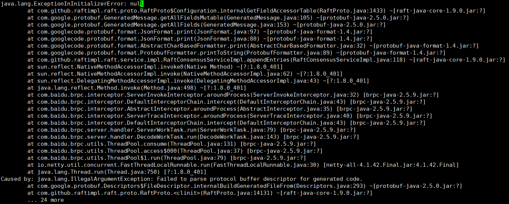
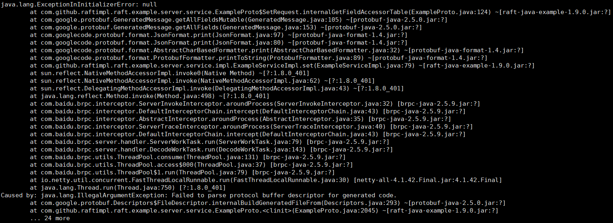
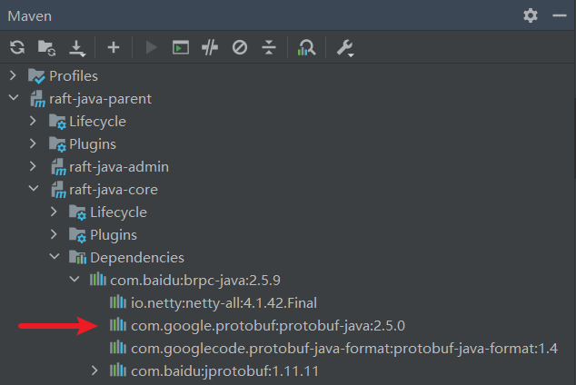
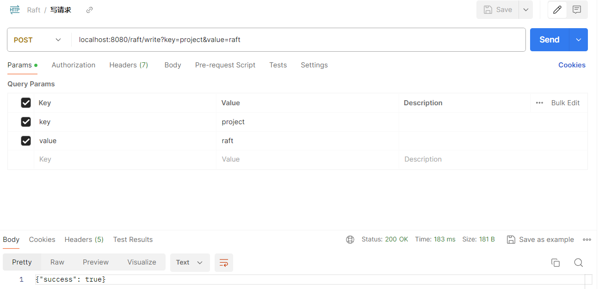
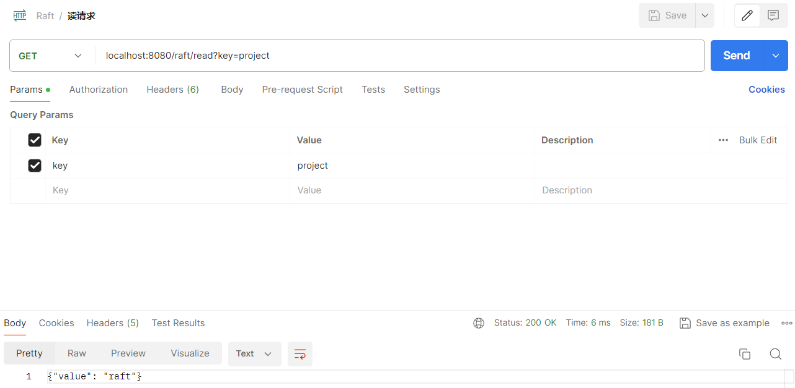

# Raft-Impl部署与排错

## 部署

### 配置Linux服务器

+ 由于项目本次在Linux系统上运行测试，因此准备Linux系统环境。

+ 使用 `VMWare Workstation` 创建虚拟机，安装 `CentOS 7` 系统。

  >  使用的光盘镜像版本为 `CentOS-7-x86_64-DVD-2009.iso` 。

+ 进行基本的网络配置，以使用 `Xshell` 和 `Xftp` 远程进行命令行操作和传输文件，详细步骤在此略过。


### 准备Java环境

+ 项目是Java项目，因此需要在Linux服务器上准备Java环境。

+ 下载JDK压缩包。

  > 版本为 `jdk-8u401-linux-x64.tar.gz` 。

+ 使用 `Xftp` 将JDK压缩包上传到Linux服务器。

  > 路径为 `/usr/local/java` 。

+ 将JDK压缩包解压缩。

  > 执行如下命令。
  >
  > ```shell
  > cd /usr/local/java && tar -zxvf jdk-8u401-linux-x64.tar.gz
  > ```

+ 配置Java环境变量。

  > 执行如下命令，编辑系统环境变量配置文件。
  >
  > ```shell
  > vim /etc/profile
  > ```
  >
  > 在文件末尾追加以下内容。
  >
  > ```
  > export JAVA_HOME=/usr/local/java/jdk1.8.0_401
  > export CLASSPATH=.:$JAVA_HOME/jre/lib/rt.jar:$JAVA_HOME/lib/dt.jar:$JAVA_HOME/lib/tools.jar
  > export PATH=$JAVA_HOME/bin:$PATH
  > ```
  >
  > 执行如下命令，刷新系统环境变量配置。
  >
  > ```shell
  > source /etc/profile
  > ```

+ 验证环境。

  > 执行如下命令，查看Java版本。
  >
  > ```shell
  > java -version
  > ```
  >
  > 出现下列信息，证明Java环境配置成功。
  >
  > ```
  > java version "1.8.0_401"
  > Java(TM) SE Runtime Environment (build 1.8.0_401-b10)
  > Java HotSpot(TM) 64-Bit Server VM (build 25.401-b10, mixed mode)
  > ```


### 准备Maven环境

+ 项目是Maven项目，上传源码到Linux服务器后再进行打包运行，因此需要在Linux服务器上准备Maven环境。

+ 下载Maven压缩包。

  > 版本为 `apache-maven-3.9.6-bin.tar.gz` 。

+ 使用 `Xftp` 将Maven压缩包上传到Linux服务器。

  > 路径为 `/usr/local/maven` 。

+ 将Maven压缩包解压缩。

  > 执行如下命令。
  >
  > ```shell
  > cd /usr/local/maven && tar -zxvf apache-maven-3.9.6-bin.tar.gz
  > ```

+ 配置Maven环境变量。

  > 执行如下命令，编辑系统环境变量配置文件。
  >
  > ```shell
  > vim /etc/profile
  > ```
  >
  > 在文件末尾追加以下内容。
  >
  > ```
  > export MAVEN_HOME=/usr/local/maven/apache-maven-3.9.6
  > export PATH=$MAVEN_HOME/bin:$PATH
  > ```
  >
  > 执行如下命令，刷新系统环境变量配置。
  >
  > ```shell
  > source /etc/profile
  > ```

+ 验证环境。

  > 执行如下命令，查看Maven版本。
  >
  > ```shell
  > mvn -version
  > ```
  >
  > 出现下列信息，证明Maven环境配置成功。
  >
  > ```
  > Apache Maven 3.9.6 (bc0240f3c744dd6b6ec2920b3cd08dcc295161ae)
  > Maven home: /usr/local/maven/apache-maven-3.9.6
  > Java version: 1.8.0_401, vendor: Oracle Corporation, runtime: /usr/local/java/jdk1.8.0_401/jre
  > Default locale: zh_CN, platform encoding: UTF-8
  > OS name: "linux", version: "3.10.0-1160.el7.x86_64", arch: "amd64", family: "unix"
  > ```

+ 为了加快依赖的下载，添加国内镜像仓库源。

  > 使用 `Xftp` 编辑Maven安装目录下的 `conf/settings.xml` 配置文件。
  >
  > 在 `<mirrors>` 标签内添加以下标签。
  >
  > ```xml
  > <mirror>
  >     <id>aliyunmaven</id>
  >     <mirrorOf>*</mirrorOf>
  >     <name>阿里云公共仓库</name>
  >     <url>https://maven.aliyun.com/repository/public</url>
  > </mirror>    
  > ```

+ 配置依赖下载存储路径。

  > 使用 `Xftp` 编辑Maven安装目录下的 `conf/settings.xml` 配置文件。
  >
  > 添加以下标签。
  >
  > ```xml
  > <localRepository>/usr/local/maven/apache-maven-3.9.6/mvn_repo</localRepository>
  > ```


### 部署项目

+ 使用 `Xftp` 将项目源码目录上传到Linux服务器。

  > 路径为 `/usr/local` 。

+ 根据项目提供的操作文档，部署三个服务端实例。

  > 执行如下命令。
  >
  > ```shell
  > cd /usr/local/raft/raft-java-example && sh deploy.sh
  > ```

+ 检查服务端实例的运行情况。

  > 执行如下命令，查看三个服务端进程信息。
  >
  > ```shell
  > ps -ef | grep run_server.sh
  > ```
  >
  > 可以看到三个服务端进程正在运行。
  >
  > ```
  > root       4647      1  0 11:33 pts/0    00:00:00 /bin/bash ./bin/run_server.sh ./data 127.0.0.1:8051:1,127.0.0.1:8052:2,127.0.0.1:8053:3 127.0.0.1:8051:1
  > root       4670      1  0 11:33 pts/0    00:00:00 /bin/bash ./bin/run_server.sh ./data 127.0.0.1:8051:1,127.0.0.1:8052:2,127.0.0.1:8053:3 127.0.0.1:8052:2
  > root       4693      1  0 11:33 pts/0    00:00:00 /bin/bash ./bin/run_server.sh ./data 127.0.0.1:8051:1,127.0.0.1:8052:2,127.0.0.1:8053:3 127.0.0.1:8053:3
  > ```

+ 部署脚本 `deploy.sh` 的逻辑。

  > 先将核心模块进行Maven项目打包，并进入测试目录。
  >
  > ```shell
  > cd ../raft-java-core && mvn clean install -DskipTests
  > cd -
  > mvn clean package
  > 
  > EXAMPLE_TAR=raft-java-example-1.9.0-deploy.tar.gz
  > ROOT_DIR=./env
  > mkdir -p $ROOT_DIR
  > cd $ROOT_DIR
  > ```
  >
  > 在测试目录下创建一个服务端实例的目录，将打包完的Maven项目复制并解压到此服务端实例的目录下，为所有脚本赋予了执行权限，并执行 `run_server.sh` 脚本，后台启动服务端实例。此逻辑共执行了三次，因此总共创建了三个服务端实例并启动。
  >
  > ```shell
  > mkdir example1
  > cd example1
  > cp -f ../../target/$EXAMPLE_TAR .
  > tar -zxvf $EXAMPLE_TAR
  > chmod +x ./bin/*.sh
  > nohup ./bin/run_server.sh ./data "127.0.0.1:8051:1,127.0.0.1:8052:2,127.0.0.1:8053:3" "127.0.0.1:8051:1" &
  > cd -
  > ```
  >
  > 在测试目录下创建一个客户端实例的目录，将打包完的Maven项目复制并解压到此服务端实例的目录下，为所有脚本赋予了执行权限。
  >
  > ```shell
  > mkdir client
  > cd client
  > cp -f ../../target/$EXAMPLE_TAR .
  > tar -zxvf $EXAMPLE_TAR
  > chmod +x ./bin/*.sh
  > cd -
  > ```

+ 服务端启动脚本 `run_server.sh` 的逻辑。

  > 接收三个客户端参数，分别为：
  >
  > 1. 当前节点的数据目录。
  > 2. 集群所有节点的IP地址、端口号和节点ID。
  > 3. 当前节点的IP地址、端口号和节点ID。
  >
  > ```shell
  > DATA_PATH=$1
  > CLUSTER=$2
  > CURRENT_NODE=$3
  > ```
  >
  > 配置了一系列JVM运行参数，包括内存和GC等，但没有使用。
  >
  > 执行 `java` 命令，并传递了三个客户端参数。
  >
  > ```shell
  > RUNJAVA="$JAVA_HOME/bin/java"
  > MAIN_CLASS=com.github.raftimpl.raft.example.server.ServerMain
  > $RUNJAVA $JAVA_CP $MAIN_CLASS $DATA_PATH $CLUSTER $CURRENT_NODE
  > ```


## 测试

### 读写请求

+ 根据项目提供的操作文档，运行客户端实例，发起写请求。

  > 执行如下命令。
  >
  > ```shell
  > /usr/local/raft/raft-java-example/env/client/bin/run_client.sh "list://127.0.0.1:8051,127.0.0.1:8052,127.0.0.1:8053" hello world
  > ```

+ 根据项目提供的操作文档，运行客户端实例，发起写请求。

  > 执行如下命令。
  >
  > ```shell
  > /usr/local/raft/raft-java-example/env/client/bin/run_client.sh "list://127.0.0.1:8051,127.0.0.1:8052,127.0.0.1:8053" hello
  > ```

+ 客户端启动脚本 `run_client.sh` 的逻辑。

  > 配置了一系列JVM运行参数，包括内存和GC等，但没有使用。
  >
  > 执行 `java` 命令，并传递了所有客户端参数。
  >
  > ```shell
  > RUNJAVA="$JAVA_HOME/bin/java"
  > MAIN_CLASS=com.github.raftimpl.raft.example.client.ClientMain
  > $RUNJAVA $JAVA_CP $MAIN_CLASS "$@"
  > ```
  >
  > 接收两个或三个客户端参数，分别为：
  >
  > 1. 服务端集群所有节点的IP地址和端口号。
  > 2. Key。
  > 3. Value。
  >
  > 客户端处理参数的逻辑为：
  >
  > 1. 如果用户传入了前两个参数，没有传入Value参数，则发起读请求，根据Key读取Value。
  >
  > 2. 如果用户传入了三个参数，则发起写请求，将Key-Value写入集群。


## Debug

+ 测试写请求时，抛出了异常，测试失败。

  

+ 分析客户端异常栈信息。

  > 异常在客户端主类的主方法中抛出。
  >
  > ```
  > at com.github.raftimpl.raft.example.client.ClientMain.main(ClientMain.java:36)
  > ```
  >
  > 抛出位置为以下代码。
  >
  > ```java
  > ExampleProto.SetResponse setResponse = exampleService.set(setRequest);
  > ```
  >
  > 因此异常是在发送写请求并获取响应时产生的。
  >
  > 继续深入异常栈，发现异常是类初始化异常。
  >
  > ```
  > Caused by: com.baidu.brpc.exceptions.RpcException: Could not initialize class com.github.raftimpl.raft.example.server.service.ExampleProto
  > 	at com.baidu.brpc.protocol.standard.BaiduRpcProtocol.decodeResponse(BaiduRpcProtocol.java:162)
  > ```
  >
  > 可以看出，异常在经过拦截器处理前已经产生，并且是在RPC解码响应时抛出，这说明服务端存在异常。

+ 查看服务端运行日志。

  

  

+ 服务端确实存在异常。分析服务端异常栈信息。

  > 服务端发生了同类型的两种异常，都是由类初始化引起的。
  >
  > ```
  > java.lang.ExceptionInInitializerError: null
  > ```
  >
  > 继续深入异常栈，发现类初始化发生异常的原因是解析Protobuf生成代码的描述符失败。
  >
  > ```
  > Caused by: java.lang.IllegalArgumentException: Failed to parse protocol buffer descriptor for generated code.
  > ```
  >
  > 两种异常分别是加载**RaftProto**类和**ExampleProto**类产生的。
  >
  > ```
  > at com.github.raftimpl.raft.proto.RaftProto.<clinit>(RaftProto.java:14131) ~[raft-java-core-1.9.0.jar:?]
  > ```
  >
  > ```
  > at com.github.raftimpl.raft.example.server.service.ExampleProto.<clinit>(ExampleProto.java:2045) ~[raft-java-example-1.9.0.jar:?]
  > ```

+ 分析代码产生异常的原因。

  > 由于服务端的两种异常类型相同，就从**ExampleProto**类入手进行分析。
  >
  > 抛出异常的方法是**\<clinit\>**，即类的静态代码块。
  >
  > 静态代码块的运行逻辑如下。
  >
  > ```java
  > java.lang.String[] descriptorData = { ... };
  > InternalDescriptorAssigner assigner = new InternalDescriptorAssigner() { ... };
  > FileDescriptor.internalBuildGeneratedFileFrom(descriptorData, new FileDescriptor[] {}, assigner);
  > ```
  >
  > 从上述的服务端异常栈信息可以看出，静态代码块中的异常是在**internalBuildGeneratedFileFrom()**方法中抛出的，而方法的参数中包含了静态代码块里赋值的两个变量和一个空数组，因此异常可能是由于两个变量的值存在问题导致的。

  > 关于**ExampleProto**类，实际上它是使用Protobuf编译器编译proto文件自动生成的代码。
  >
  > Protobuf是一种用于RPC的通信协议，按照一定方式对发送方构造的消息进行编码，发送给接收方，接收方再以相同方式解码。
  >
  > Protobuf在开发中的使用方式是，开发者使用Protobuf语法编写proto文件，定义消息的结构，并使用编译器protoc，根据proto文件，自动生成开发者所使用的开发语言的代码。开发者通过自动生成的代码中提供的接口，将数据封装成定义好的消息，用于RPC通信。

  > 既然是自动生成的代码，那么直接从代码入手分析异常是较为困难的。
  >
  > 但是项目中提供了proto文件，因此可以重新编译，对比编译结果，定位问题。

+ 重新编译proto文件。

  > 1. 查看项目的依赖，可以看到，项目所使用的是2.5.0版本的Protobuf。
  >
  > 
  >
  > 2. 下载2.5.0版本的编译器压缩包并解压。
  >
  >    `protoc-2.5.0-win32.zip`
  >
  > 3. 配置系统环境变量，在Path环境变量中添加protoc.exe可执行文件所在的目录。
  >
  >    `D:\protoc-2.5.0-win32`
  >
  > 4. 打开CMD命令行窗口。
  >
  > 5. 执行如下命令，查看protoc版本。
  >
  >    ```
  >    protoc --version
  >    ```
  >
  >    出现下列信息，证明protoc环境配置成功。
  >
  >    ```
  >    libprotoc 2.5.0
  >    ```
  >
  > 6. 分别在项目中两个proto文件所在目录打开CMD命令行窗口，执行如下命令，编译proto文件。
  >
  >    ```
  >    protoc --java_out=./proto example.proto
  >    ```
  >
  >    ```
  >    protoc --java_out=./proto raft.proto
  >    ```

+ 对比编译结果。

  > 使用文件比较，对比项目中的**RaftProto**类和**ExampleProto**类与重新编译生成的类。
  >
  > 
  >
  > 
  >
  > 结果显示，文件差异仅发生在静态代码块的**descriptorData**变量的字符串中，这一结果也验证了上述推断。

+ 修复。

  > 使用重新编译生成的文件覆盖项目中的文件。

+ 重新部署项目并测试。

  > 写请求。
  >
  > ```
  > set request, key=hello value=world response={"success": true}
  > ```
  >
  > 读请求。
  >
  > ```
  > get request, key=hello, response={"value": "world"}
  > ```
  >
  > 读请求和写请求都通过测试，正常执行并输出结果信息，debug完成。


## 客户端对接Spring Boot处理HTTP读写请求

+ 为了方便Linux服务器上服务端实例集群启动，编写启动脚本 `run_cluster.sh` 。

  > 执行如下命令，创建脚本文件 `run_cluster.sh` 。
  >
  > ```shell
  > cd /usr/local/raft/raft-java-example/env && vim run_cluster.sh
  > ```
  >
  > 在脚本文件中写入以下内容。
  >
  > ```shell
  > #!/usr/bin/env bash
  > 
  > cd /usr/local/raft/raft-java-example/env
  > 
  > for i in 1 2 3
  > do
  >   cd example$i
  >   nohup ./bin/run_server.sh ./data "127.0.0.1:8051:1,127.0.0.1:8052:2,127.0.0.1:8053:3" "127.0.0.1:805$i:$i" &
  >   cd -
  > done
  > ```
  >
  > 执行如下命令，为脚本文件赋予执行权限。
  >
  > ```shell
  > chmod +x run_cluster.sh
  > ```

+ 开放Linux服务器端口号。

  > 由于本次客户端请求是通过远程访问，因此需要开放端口号。
  > 执行如下命令，配置并重启防火墙。
  >
  > ```shell
  > firewall-cmd --add-port=8051-8053/tcp --permanent && systemctl restart firewalld
  > ```

+ 创建Spring Boot项目，作为服务端接收用户的HTTP读写请求，并作为客户端通过RPC访问Linux服务器上的Raft项目服务端。

  > 在pom.xml配置文件中，引入两个主要依赖。第一个依赖是Spring Boot Web的起步依赖，第二个依赖是项目示例模块的依赖。引入示例模块，而不是直接创建新的类，主要目的是为了保证客户端与服务端的两个核心接口`ExampleService`接口和`ExampleProto`类的全限定名以及内容一致，即使类文件相同，如果类的包路径不同，也会导致RPC失败。
  >
  > ```xml
  > <dependency>
  >     <groupId>org.springframework.boot</groupId>
  >     <artifactId>spring-boot-starter-web</artifactId>
  >     <version>2.5.9</version>
  > </dependency>
  > <dependency>
  >     <groupId>com.github.raftimpl.raft</groupId>
  >     <artifactId>raft-java-example</artifactId>
  >     <version>1.9.0</version>
  > </dependency>
  > ```
  >
  > 在application.properties配置文件中自定义配置项，配置RPC服务端地址，在本例中是集群的多个节点地址。
  >
  > ```properties
  > raft-impl.cluster.address=192.168.227.117:8051,192.168.227.117:8052,192.168.227.117:8053
  > ```
  >
  > 将RPC客户端接口进行封装并注册到Spring容器。组件中主要完成三项工作：从application.properties配置文件读取RPC服务端地址，创建RPC客户端和服务接口，将服务接口的方法进行封装并对外提供新的接口。
  >
  > ```java
  > @Slf4j
  > @Component
  > public class RaftTemplate {
  >     @Value("${raft-impl.cluster.address}")
  >     private String address;
  >     private ExampleService exampleService;
  >     private final JsonFormat format = new JsonFormat();
  > 
  >     @PostConstruct
  >     private void init() {
  >         RpcClient rpcClient = new RpcClient("list://" + address);
  >         exampleService = BrpcProxy.getProxy(rpcClient, ExampleService.class);
  >     }
  > 
  >     public String read(String key) {
  >         ExampleProto.GetRequest request = ExampleProto.GetRequest.newBuilder()
  >                 .setKey(key).build();
  >         ExampleProto.GetResponse response = exampleService.get(request);
  >         String result = format.printToString(response);
  >         log.info("读请求执行，key={}：{}", key, result);
  >         return result;
  >     }
  > 
  >     public String write(String key, String value) {
  >         ExampleProto.SetRequest request = ExampleProto.SetRequest.newBuilder()
  >                 .setKey(key).setValue(value).build();
  >         ExampleProto.SetResponse response = exampleService.set(request);
  >         String result = format.printToString(response);
  >         log.info("写请求执行，key={}，value={}：{}", key, value, result);
  >         return result;
  >     }
  > }
  > ```
  >
  > 创建HTTP请求处理的控制层，对接RPC客户端接口和HTTP请求。
  >
  > ```java
  > @RestController
  > @RequestMapping("/raft")
  > public class TestController {
  >     @Autowired
  >     private RaftTemplate raftTemplate;
  > 
  >     @PostMapping("/write")
  >     public String write(@RequestParam String key, @RequestParam String value) {
  >         return raftTemplate.write(key, value);
  >     }
  > 
  >     @GetMapping("/read")
  >     public String read(@RequestParam String key) {
  >         return raftTemplate.read(key);
  >     }
  > }
  > ```

+ 测试HTTP读写请求。

  > 启动Spring Boot项目，并使用 `Postman` 进行测试。
  >
  > 读请求。
  >
  > 
  >
  > 写请求。
  >
  > 
  >
  > 读请求和写请求都通过测试，正常执行。

  

